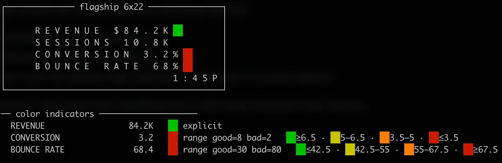

# vesta

A small Python formatter / previewer / publisher for Vestaboard devices.

The goal is simple:

**semantic input → compact board layout → terminal preview → optional publish**

This repo is intentionally focused on practical use, not a big template language or a hosted service.



## What it does

- formats structured data for Vestaboard
- supports multiple device profiles
  - flagship board: **6 x 22**
  - note: **3 x 15**
- previews output in the terminal before sending
- can publish via:
  - Vestaboard Cloud API
  - Vestaboard Local API

## Templates

- `text` — simple wrapped text
- `kv` — key/value rows
- `table` — compact table from CSV or JSON array of objects
- `metrics` — generic key/value layout with optional trailing color indicators
- `auto` — picks a reasonable renderer based on input shape

## Key suffixes

The `metrics` template recognises special suffixes on field names to handle
formatting automatically. The suffix is always stripped from the label on the board.

| Suffix | Effect |
|--------|--------|
| `_pct` / `_percent` | formats value as `3.2%`, adds color tone indicator |
| `_curr` | formats value as `$84.2K` |

```json
{
  "revenue_curr": 84210.50,
  "sessions": 10823,
  "growth_pct": 12.4
}
```

Renders as:
```
REVENUE   $84.2K
SESSIONS  10.8K
GROWTH    12% ██
```

## Color indicators (experimental)

The `metrics` template supports trailing colored tile indicators on rows.
Color is driven by semantic tone — not raw cell placement.

**Auto-detection:** tone is inferred when a field name contains `pct`, `percent`,
`change`, `delta`, or `diff` and the value is numeric:
- positive → green
- negative → red
- zero → white

**Explicit tone:** override any field with `_style`:

```json
{
  "score": 91.2,
  "_style": {
    "score": "good"
  }
}
```

Accepted tone names: `good`, `bad`, `warn`, `info`, `neutral`, `muted`,
or any color directly: `green`, `red`, `yellow`, `blue`, `white`, `black`,
`violet`, `orange`.

**Range-based tone:** specify `good` and `bad` thresholds and the indicator
will follow a 4-step green → yellow → orange → red gradient. Direction is
implicit — wherever `good` sits numerically is the green end:

```json
{
  "bounce_rate": 68.4,
  "conversion": 3.2,
  "_style": {
    "bounce_rate": {"good": 30, "bad": 80},
    "conversion":  {"good": 8,  "bad": 2}
  }
}
```

`_style` and other `_`-prefixed keys are never shown on the board.

**Debug flag:** add `--explain` to see a breakdown of which fields got color
indicators, why, and what thresholds trigger each zone:

```bash
cat metrics.json | vesta render --template metrics --preview-only --explain
```

## Layout flags

**`--valign [top|center]`** — vertical alignment of the content block.
Default is `top`. Use `center` when you have fewer rows of data than the
board height and want breathing room above and below.

**`--align [left|center]`** — horizontal alignment of metrics rows.
Default is `left`. Use `center` to indent the content block as a unit —
all rows start at the same left offset (determined by the widest row),
giving a cleaner look when the data is compact:

```
┌────────────── flagship 6x22 ───────────────┐
│                                            │
│      T E M P   6 8                         │
│      H U M I D I T Y   4 2                 │
│      W I N D   D E L T A   3 . 2 % ██      │
│      R A I N   - 1 3 % ██                  │
│                                  1 : 3 0 P │
└────────────────────────────────────────────┘
```

**`--timestamp`** — adds the current time (`10:01A`, `9:30P`) to the
bottom-right corner. Requires the timestamp width plus a 2-cell buffer to
be blank at the right of the last row — silently skipped if there isn't room.
Use **`--force-timestamp`** to place it regardless.

**`--tz`** — IANA timezone for the timestamp, e.g. `America/New_York`.
Defaults to local system time. 24h locale support is not yet handled.

```bash
cat metrics.json | vesta render --template metrics \
  --valign center --align center --timestamp --preview-only
```

**Preview a saved board** — if the input is a raw character code grid (the
JSON output from `--json-only`), vesta decodes and previews it directly:

```bash
cat testdata/metrics_styled.json | vesta render --template metrics --json-only > saved.json
cat saved.json | vesta render --preview-only
```

## Why this exists

Hitting the Vestaboard API directly is easy.

The harder and more useful part is:
- making structured data fit well on a small grid
- compacting numbers and timestamps automatically
- previewing output locally before sending
- reusing layouts across scripts and data sources

This project is mainly about that rendering layer.

## Installation

```bash
pip install vesta
```

Or run from source with [uv](https://github.com/astral-sh/uv):

```bash
uv run vesta.py render
```

## Example usage

Render text:

```bash
echo '"hello world"' | vesta render
```

Render a key/value dict:

```bash
echo '{"temp": "72F", "wind": "12mph"}' | vesta render --template kv
```

Render a metrics payload with suffix formatting and color indicators:

```bash
echo '{
  "revenue_curr": 84210.50,
  "sessions": 10823,
  "conversion_pct": 3.2,
  "bounce_rate_pct": 68.4,
  "_style": {
    "revenue_curr": "good",
    "conversion_pct": {"good": 8, "bad": 2},
    "bounce_rate_pct": {"good": 30, "bad": 80}
  }
}' | vesta render --template metrics --valign center --align center --timestamp --preview-only --explain
```

Preview only (no character output):

```bash
cat data.json | vesta render --preview-only
```

Get raw character codes for the Vestaboard API:

```bash
cat data.json | vesta render --json-only
```

Publish via Cloud API:

```bash
cat data.json | vesta post-cloud --token $VESTABOARD_TOKEN
```

Publish via Local API:

```bash
cat data.json | vesta post-local --api-key $VESTABOARD_LOCAL_API_KEY
```

Preview what's currently on your board:

```bash
vesta read-cloud
```

Uses `VESTABOARD_TOKEN` from the environment. Board profile (flagship vs note) is
auto-detected from the grid dimensions returned by the API. Pass `--profile` to
override if needed.

Use the Note profile:

```bash
cat data.json | vesta render --profile note --template metrics
```

## Current status

Early but functional. Some areas are still experimental:
- semantic color / tone indicators
- ANSI terminal preview rendering
- how much formatting logic belongs in templates vs shared helpers

Comments in the code mark anything that is still being tried and may change.
