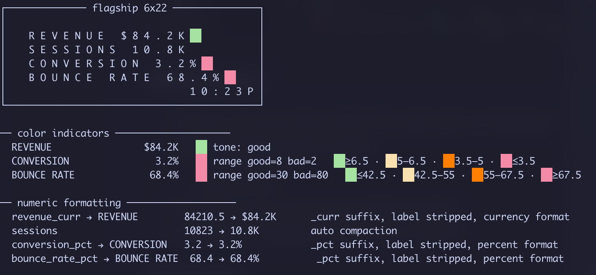

# vesta

[](https://github.com/q/vesta/actions/workflows/ci.yml)
[](https://pypi.org/project/vestaboard-tools/)
[](https://pypi.org/project/vestaboard-tools/)
[](LICENSE)

A small Python formatter / previewer / publisher for Vestaboard devices.

**semantic input → board layout → terminal preview → optional publish**



## What it does

- Formats structured data (JSON, CSV, plain text) for Vestaboard
- Supports multiple device profiles:
  - flagship: **6 × 22**
  - note: **3 × 15**
- Previews output in the terminal before sending
- Publishes via Vestaboard Cloud API or Local API

## Templates

| Template | Input | Behaviour |
|----------|-------|-----------|
| `text` | string | Wrapped and centered text |
| `kv` | JSON object | Key / value rows, no formatting |
| `data` | JSON object or array | Label/value rows (object) or columnar table (array). Applies suffix formatting and color indicators. |
| `auto` | any | Picks the best renderer based on input shape (default) |

`metrics` and `table` are accepted as aliases for `data`.

CSV is auto-detected — no `--template` flag needed.

## Key suffixes

Field name suffixes control formatting automatically. The suffix is stripped from the label on the board.

| Suffix | Effect |
|--------|--------|
| `_pct` / `_percent` | formats value as `3.2%`, adds color tone indicator |
| `_curr` | formats value as `$84.2K` |

```json
{
  "revenue_curr": 84210.50,
  "sessions": 10823,
  "growth_pct": 12.4
}
```

Renders as:

```
REVENUE   $84.2K
SESSIONS  10.8K
GROWTH    12.4% ██
```

## Color indicators

Color is driven by semantic tone, not raw cell placement. The trailing colored tile is added automatically when a tone can be determined.

**Auto-detection:** inferred when a field name contains `pct`, `percent`, `change`, `delta`, or `diff` and the value is numeric:
- positive → green
- negative → red
- zero → white

**Explicit tone:** set via `_style`:

```json
{
  "score": 91.2,
  "_style": { "score": "good" }
}
```

Accepted tone names: `good`, `bad`, `warn`, `info`, `neutral`, `muted`,
or a direct color: `green`, `red`, `yellow`, `blue`, `white`, `black`, `violet`, `orange`.

**Range-based tone:** specify `good` and `bad` thresholds for a 4-step gradient. Direction is implicit — wherever `good` sits numerically is the green end:

```json
{
  "bounce_rate": 68.4,
  "_style": { "bounce_rate": {"good": 30, "bad": 80} }
}
```

| Zone | Color | Position |
|------|-------|----------|
| 1st quarter | green | 0–25% toward bad |
| 2nd quarter | yellow | 25–50% |
| 3rd quarter | orange | 50–75% |
| 4th quarter | red | 75–100% (and beyond) |

`_style` and other `_`-prefixed keys are never shown on the board.

Use `--explain` to see which fields got indicators and why:

```bash
cat metrics.json | vesta render --template data --preview-only --explain
```

## Layout flags

**`--title TEXT`**

Adds a title row at the top with colored tile bookends. Tries 2 tiles each side, falls back to 1 if the text is long.

**`--title-color COLOR[,COLOR,COLOR]|none`**

Color of the bookend tiles. Defaults to `white`. Pass `none` for a plain centered title with no tiles. Pass up to 3 comma-separated colors to use multiple tiles — the right side mirrors the left: `--title-color red,blue,orange` places `red blue orange` on the left and `orange blue red` on the right. Falls back through fewer tiles if the title text is too long to fit.

**`--subtitle TEXT|time`**

Optional second row below the title, with a single tile bookend on each side (same color as title). Use the special value `time` to insert the current time. You can also embed the subtitle directly in the title using a newline — `--title $'Weather\nSan Francisco'` — and the second line becomes the subtitle automatically (explicit `--subtitle` takes precedence).

**`--separator [PATTERN]`**

Adds a full-width row of colored tiles below the title block (after subtitle if present). Used alone, defaults to solid white. Accepts:

| Pattern | Result |
|---------|--------|
| *(omitted)* | solid white |
| `white`, `blue`, `red`, … | solid named color |
| `rainbow` | R O Y G B V cycling |
| `red,black` | alternating colors |

```bash
echo '{"temp": "72F", "wind": "12mph", "humidity": "45%"}' | \
  vesta render --template kv --title "Weather" --separator rainbow --preview-only
```

```
┌────────────── flagship 6x22 ───────────────┐
│████          W E A T H E R             ████│
│████████████████████████████████████████████│
│T E M P                               7 2 F │
│W I N D                           1 2 M P H │
│H U M I D I T Y                       4 5 % │
│                                            │
└────────────────────────────────────────────┘
```

```bash
vesta render --input weather.json --template kv --columns 2 \
  --title "BROOKLYN WEATHER" --title-color white --subtitle time --preview-only
```

```
┌────────────── flagship 6x22 ───────────────┐
│████  B R O O K L Y N   W E A T H E R   ████│
│██              1 0 : 4 3 P               ██│
│N O W     6 2 F     R A I N           0 %   │
│L I K E   6 2 F     W I N D     1 5 M P H   │
│H I G H   6 6 F     U V             4 . 4 ██│
│L O W     4 8 F     S E T     7 : 3 2 P M   │
└────────────────────────────────────────────┘
```

**`--columns [1|2]`** *(kv template only)*

Pack two key-value pairs per row instead of one. Each column is sized independently to its own content, which creates a natural gap between columns. Color indicators from `_style` or auto-detection still apply: left-column tiles appear in the gap; right-column tiles appear at the board's right edge.

```bash
echo '{"now":"62F","rain":"0%","high":"66F","low":"48F"}' | \
  vesta render --template kv --columns 2 --preview-only
```

```
┌────────────── flagship 6x22 ───────────────┐
│N O W     6 2 F             R A I N     0 % │
│H I G H   6 6 F             L O W     4 8 F │
│                                            │
│                                            │
│                                            │
│                                            │
└────────────────────────────────────────────┘
```

Falls back to `--columns 1` with a warning if the content is too wide for the profile.

**`--align [left|center|right]`**

For **metrics** (JSON object): aligns the content block horizontally as a unit. Default is `left`.

For **tables** (JSON array or CSV): default is `center` (compact block, centered). `left` and `right` spread columns edge-to-edge with equal inter-column gaps — first column anchored to the chosen edge, last column anchored to the opposite edge.

**`--valign [top|center]`**

Vertical alignment of the content block. Default is `top`. Use `center` for breathing room when you have fewer rows than the board height.

**`--timestamp`**

Adds the current time (`10:01A`, `9:30P`) to the bottom-right corner. Silently skipped if there isn't room. Use `--force-timestamp` to place it regardless, overwriting content if needed.

**`--tz`**

IANA timezone for the timestamp, e.g. `America/New_York`. Defaults to local system time.

**`--profile [flagship|note]`**

Board profile. Auto-detected from API grid dimensions when publishing. Defaults to flagship.

## Example usage

**Text:**

```bash
echo '"hello world"' | vesta render --preview-only
```

```
┌────────────── flagship 6x22 ───────────────┐
│                                            │
│                                            │
│          H E L L O   W O R L D             │
│                                            │
│                                            │
│                                            │
└────────────────────────────────────────────┘
```

**Key/value:**

```bash
echo '{"temp": "72F", "wind": "12mph"}' | vesta render --template kv --preview-only
```

```
┌────────────── flagship 6x22 ───────────────┐
│T E M P                               7 2 F │
│W I N D                           1 2 M P H │
│                                            │
│                                            │
│                                            │
│                                            │
└────────────────────────────────────────────┘
```

**Key/value 2-col with title:**

```bash
vesta render --input testdata/weather.json --template kv --columns 2 \
  --title "BROOKLYN WEATHER" --subtitle time --preview-only
```

```
┌────────────── flagship 6x22 ───────────────┐
│████  B R O O K L Y N   W E A T H E R   ████│
│██              1 0 : 4 3 P               ██│
│N O W     6 2 F     R A I N           0 %   │
│L I K E   6 2 F     W I N D     1 5 M P H   │
│H I G H   6 6 F     U V             4 . 4 ██│
│L O W     4 8 F     S E T     7 : 3 2 P M   │
└────────────────────────────────────────────┘
```

**CSV table** (auto-detected, centered by default):

```bash
vesta render --input scores.csv --preview-only
```

```
┌────────────── flagship 6x22 ───────────────┐
│    N A M E       S C O R E     R A N K     │
│    A L I C E           9 8           1     │
│    B O B               8 7           2     │
│    C A R O L           7 6           3     │
│    D A V E             6 1           4     │
│                                            │
└────────────────────────────────────────────┘
```

Use `--align left` or `--align right` to spread columns edge-to-edge instead.

**Metrics with color indicators:**

```bash
echo '{
  "revenue_curr": 84210.50,
  "sessions": 10823,
  "conversion_pct": 3.2,
  "bounce_rate_pct": 68.4,
  "_style": {
    "revenue_curr": "good",
    "conversion_pct": {"good": 8, "bad": 2},
    "bounce_rate_pct": {"good": 30, "bad": 80}
  }
}' | vesta render --template data --valign center --align center --timestamp --preview-only
```

```
┌────────────── flagship 6x22 ───────────────┐
│                                            │
│    R E V E N U E   $ 8 4 . 2 K ██          │
│    S E S S I O N S   1 0 . 8 K             │
│    C O N V E R S I O N   3 . 2 % ██        │
│    B O U N C E   R A T E   6 8 . 4 % ██    │
│                                  9 : 3 4 P │
└────────────────────────────────────────────┘
```

**Note profile:**

```bash
vesta render --input data.json --profile note --template data --preview-only
```

```
┌───────── note 3x15 ──────────┐
│T E M P           $ 7 2 . 0 0 │
│H U M I D I T Y       5 4 % ██│
│C H A N G E       - 2 . 1 % ██│
└──────────────────────────────┘
```

**Get raw character codes** (for direct API use):

```bash
cat data.json | vesta render --json-only
```

## Publishing

**Cloud API:**

```bash
cat data.json | vesta post-cloud --token $VESTABOARD_TOKEN
```

**Local API:**

```bash
cat data.json | vesta post-local --api-key $VESTABOARD_LOCAL_API_KEY
```

**Preview current board state:**

```bash
vesta read-cloud
```

`VESTABOARD_TOKEN` is read from the environment. Board profile is auto-detected from the grid dimensions returned by the API. Pass `--profile` to override.

**Re-render a saved board:**

```bash
cat data.json | vesta render --json-only > saved.json
cat saved.json | vesta render --preview-only
```

## Running the examples

```bash
./run_examples.sh
```

Runs all bundled examples against local test data. Requires no API credentials.

## Installation

```bash
pip install vestaboard-tools
```

Or run directly from source with [uv](https://github.com/astral-sh/uv):

```bash
uv run vesta.py render
```

## Why this exists

Hitting the Vestaboard API directly is straightforward. The harder part is making structured data fit well on a small fixed-size grid — compacting numbers, handling suffixes, previewing locally, and reusing layouts across scripts and data sources. This project is mainly that rendering layer.
